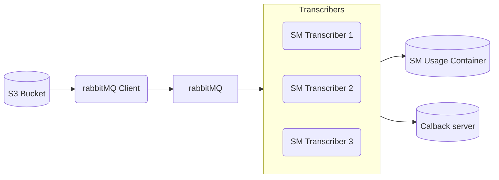

# speechmatics-demo-rabbitmq

**speechmatics-demo-rabbitmq** is a demonstration of using a message queue to process audio stored in an s3 bucket using a definable number of Speechmatics ASR workers. The resultant transcripts are posted to a basic http bucket server. The components and flow are outlined below.

## Getting Started

- Ensure you are logged into the [Speechmatics Docker repo](https://docs.speechmatics.com/en/batch-container/quick-start/#software-repository-login)
- Create a `.env` file from the provided [example.env](./example.env)
- Build and run the stack using `make all`

### Requirements

This project has been tested on Linux and WSL2, but should run in any environment which provides the following:

- GNU make
- docker
- [docker-compose v2](https://docs.docker.com/compose/cli-command/#installing-compose-v2)
- Speechmatics container license
- Speechmatics docker repo login

## Components

The components of this project may be run on a single host or multiple hosts. As built, it will run on a single host. When splitting between multiple hosts, the following dependencies must be respected:

- rabbitmq_client and sm_batch_transcriber instances must be able to reach rabbitmq
- rabbitmq_client must be able to reach s3
- sm_batch_transcriber instances must be able to reach sm-usage and callback_server

### RabbitMQ Server

We use the RabbitMQ server as pulled from Docker Hub.

### RabbitMQ Client

[rabbitmq_client](./rabbitmq_client/) is a producer which reads the contents of an s3 bucket (filterable with the `S3_FILE_PREFIX` env var), generates (1 hour validity) signed URLs for those files, and submits them to a queue of a rabbitmq server.

### Transcribe Worker

[sm_batch_transcriber](./sm_batch_transcriber/) is a consumer which retrives work items (as URLs) from a rabbitmq queue, transcribes them using Speechmatics ASR, and posts the resultant text transcript to an http endpoint.

### Speechmatics Usage

The Speechmatics asr-usage container tracks billing usage for ASR containers. It is pulled from the Speechmatics public JFrog repo. Only one instance is required regardless of number of hosts/workers.

### Callback server

[callback_server](./callback_server) is a basic HTTP bucket server which receives messages and makes them available to view in a browser at <http://{host}:8080>. This is the endpoint of the demonstration, but could be any HTTP endpoint.

## Scaling transcribe workers

By default, a single worker is spawned. To create multiple wokers, you may optionally specify how many as a parameter to `make`, i.e. `make run scale=n`

## Support

This is for demonstration only and is not supported by Speechmatics. Should you need support, please contact your Speechmatics Sales Engineer.

### License

This project is released under a proprietary Speechmatics license.

##
